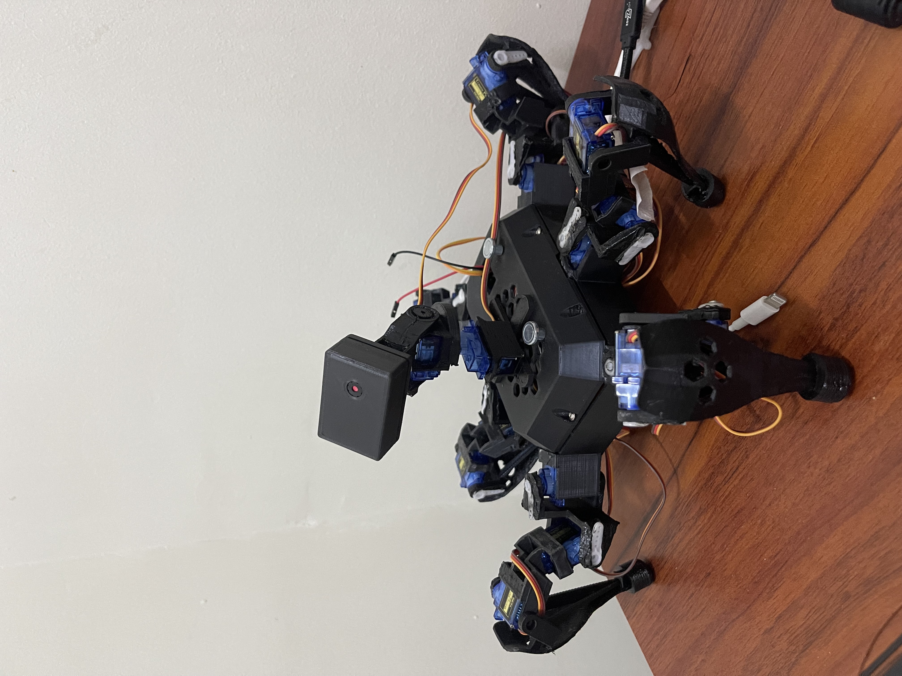

# Overview
## Components
- GP2Y0A21
- INA260 or INA3221 for 3 channel voltage detection (shunt resistors needed)
- GY-NE06MV2 GPS Module
- MPU6050 - Gyro and acceloremeter Component
- HMC5883L - Compass module
# Todos
**Hexapod**
- [ ] Print Wire holders
- [ ] Trim Latex cutlets
- [ ] Print Bracket for Lipo Battery
- [ ] Redesign and refactor 3D Model:
	- [ ] CoxA
	- [ ] CoxB
- [ ] Replace Bottom Right Abduct Motor
- [ ] Replace Bottom Left Abduct Motor
- [ ] Replace Mid Left Rotate motor
- [ ] Invert Mid Right Retract Motor
- [ ] Invert Mid Right Abduct Motor
- [ ] Replace Mid Left Retract Motor
- [ ] Test the rotating mount
- [ ] Make Hexapod Stand
- [ ] Make Hexapod kneel
- [ ] Buy Fuel gauge
- [ ] Buy Lipo battery
- [ ] Buy lipo battery charger
- [ ] Add gps, cellular, acceloremeter, temperature and humidity, fuel gauge sensors + lipo battery for esp32-cam and esp32c3
- [ ] Add feature to add macros and teach it to perform movements
- [ ] Add feature to train model from video
- [ ] Add 3D model to esp32-cam
- [ ] Connect controllers via bluetooth to frontend
- [ ] Make robot accomodate 360deg servo

**SLAM**
Install Kimera

Frontend tweaks:
- [ ] Change Favicon and Logo.svg
- [ ] Download and serve font from backend
- [ ] Access Captures and images on SD Card
- [ ] Add Overlay to 3D mesh viewer (with hexapod, with environment)
- [ ] Add Components Window
- [ ] Add Meshmap
- [ ] Finalize Rotation Analog Stick
- [ ] Finalize Kneel Analog Stick
- [ ] Add Terminal
- [ ] Add Macros
- [ ] Add Minimap
- [ ] Add loading state
- [ ] Tweak Camera Server from esp32
- [ ] Connect esp32c3 to esp32-cam
- [ ] Change Favicon
- [ ] Add 3D models
- [ ] Add loading to 3D model
- [ ] Replace model with GLTFModel
- [ ] Add 3D models to repo
- [ ] How to make the robot and assemblh
- [ ] Schematics


**ESP32-C3 Luatos Pinout**:


ADXL345:
VCC → 3.3V (pin 18 or 26)
GND → Any GND pin
SDA → Either GPIO6 or GPIO2
SCL → Either GPIO7 or GPIO3
INT1/INT2 → Any available GPIO pin
CS → Leave unconnected for I2C mode
SDO → GND for address 0x53

Co

# Writeup
## SLAM Algorithms Archetype
Subproblems to solve in SLAM:
Feature Extraction: Identifying key features
Feature matching: matching identified features between current frame and previous frame
Motion estimation: Estimating camera's motion based on feature matching step
data association: matching features to existing map elements or identifying new elements to be added to map
map managmenet: update map, handling addition of new maps and removing obsolete ones
pose graph optimization : local and global optimizations to refine the estimated poses and map, reducing the accumulated errors
Localization
Mapping
Loop Closing

### Feature Extraction
Feature extraction is the stage of the SLAM pipeline to identify distinctive key features to focus on in the next stage, [[#Feature Matching]] to discern the motion. 

Involves identifying distinctive parts of an image, such as edges, corners, shapes, textures, or patterns, to help with the localization and mapping process. 
Some key feature extraction algorithms:
- ORB -  efficient, robust, and rotation invariant. uses a combination of FAST (Features from accelerated Segment) keypoint detection and BRIEF binary descriptor

FAST (Features from Accelerated Segment Test): corner detection algorithm designed for high-speed feature detection.
1. examine 16 pixels in a circle around a candidate point
2. A pixel is classified as a corner if there exists a set of continuous pixels in the circle that are all brighter or all darker than the center pixel by some threshold

- Uses a simple pixel intensity comparison test
- Employs a quick rejection strategy for non-corners
- Can terminate the test early once sufficient evidence is found

BRIEF (Binary Robust Independent Elementary Features): Creates a binary string to describe a detected feature

1. Selecting pairs of pixels in the feature's neighborhood
2. Comparing their intensities
3. Assigning 0 or 1 based on which pixel is brighter

- Very fast to compute (just pixel comparisons)
- Efficient to store (binary string)
- Fast to match (using Hamming distance)
- Good recognition performance despite simplicity

SIFT (Scale Invariant Feature Transform):

Invariant to:
- Scale changes
- Rotation
- Translation
- Partial illumination change
- Affine distortion
- Noise

1. Scale-space Extrema Detection:
	1. Creates a scale space by convolving the image with Gaussian filters at different scales
	2. Computes Difference of Gaussians (DoG) between adjacent scales
	3. Locates potential keypoints by finding local extrema in DoG images
2. Keypoint Localization:
	1. Refines keypoint locations using interpolation
	2. Rejects low-contrast points and edges
	3. Ensures stability of detected points
3. Orientation Assignment:
	1. Computes gradient magnitude and direction around each keypoint
	2. Creates histogram of local gradient directions
	3. Assigns one or more orientations based on peak directions
	4. This step provides rotation invariance
4. Keypoint Descriptor Generation:
	1. Takes 16x16 neighborhood around keypoint
	2. Divides into 4x4 subregions
	3. Creates 8-bin orientation histogram for each subregion
	4. Results in 128-dimensional feature vector (4x4x8)
	5. Normalizes vector for illumination invariance

The Improved SIFT algorithm can improve the accuracy and robustness of a SLAM system. 
CNN-based
CNN-based feature-point extraction methods have made progress in feature-point detection and descriptor generation. However, they can be computationally and storage complex. 
Feature extraction is a preprocessing method that transforms raw data into numerical features that can be processed while preserving the original data set. This can yield better results than applying machine learning directly to the raw data. 
SLAM is the foundation of augmented reality (AR), allowing AR devices to perceive the world in three dimensions. 


Workflow:
1. Take Video and split to frames
2. Convert frames to depth maps via:
```bash
heif-convert --with-aux ~/Downloads/test.heic ~/Downloads/test.jpg
```